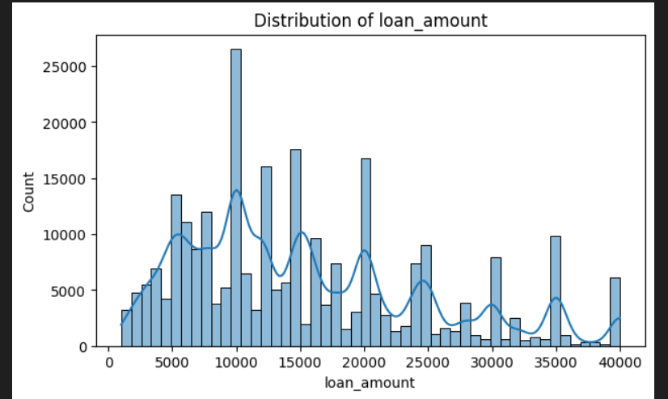
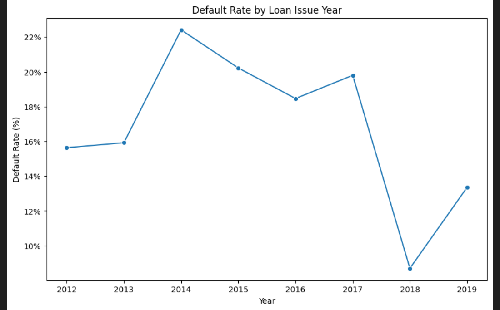
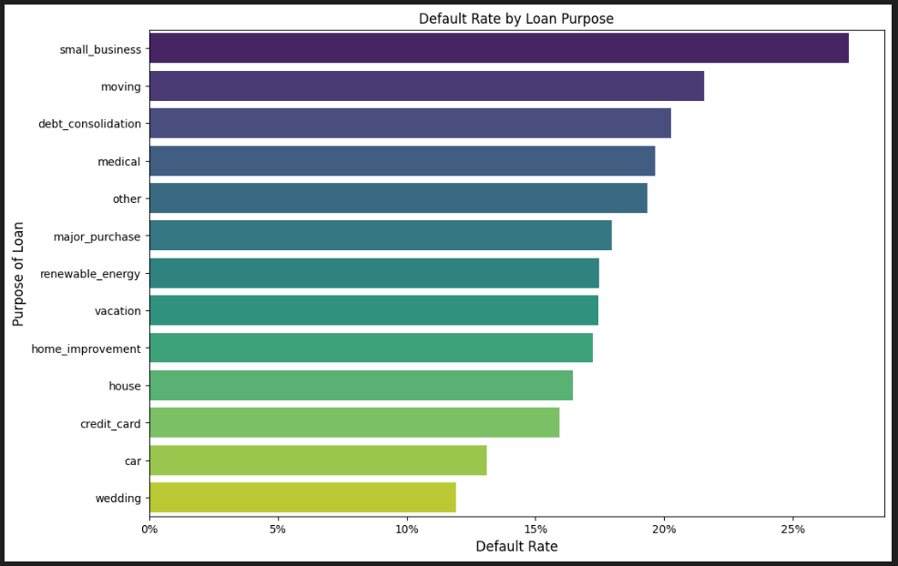
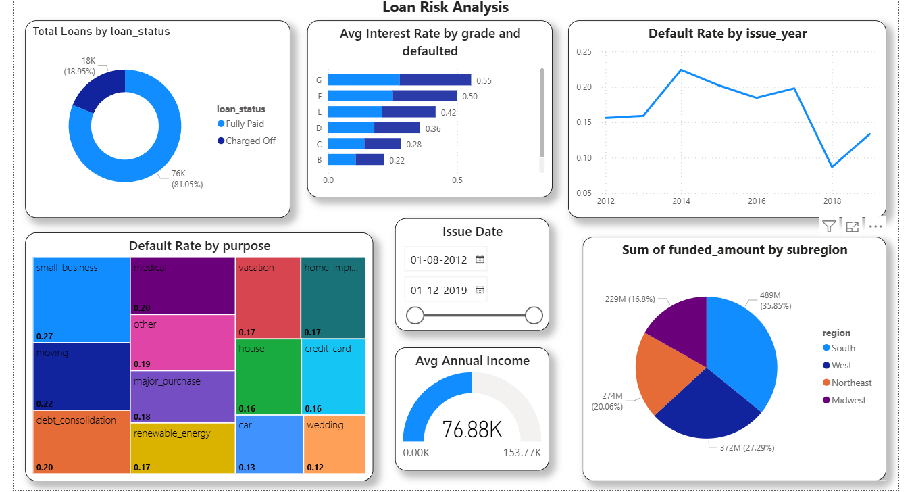

# 🏦 Loan Risk Analysis & Prediction

This project provides a comprehensive **data-driven analysis** of loan performance using **Python (EDA)** and **Power BI (BI Reporting)**.  
The goal is to uncover patterns behind **loan defaults**, assess **borrower risk profiles**, and visualize insights through interactive dashboards.

---

## 📊 Project Overview

Financial institutions often face challenges predicting whether borrowers will default on their loans.  
This analysis aims to:
- Clean and preprocess multiple loan-related datasets.
- Identify correlations between borrower attributes and loan defaults.
- Perform **exploratory data analysis (EDA)** to visualize trends.
- Build a **Power BI dashboard** for interactive decision-making.

---

## 🧰 Tools & Technologies Used

| Category | Tools |
|-----------|--------|
| Data Processing | Python, Pandas, NumPy |
| Visualization | Matplotlib, Seaborn, Power BI |
| Notebook Environment | Jupyter Notebook |
| Reporting | Power BI (Loan_Risk_Analysis.pbix) |

---

## 🧹 Data Cleaning

Key steps in data preprocessing included:
- Merging multiple CSV files: `loan.csv`, `customer.csv`, `state_region.csv`, etc.
- Handling missing and duplicate values.
- Dropping sparse columns like `annual_inc_joint` and `emp_title`.
- Imputing missing categorical fields such as `emp_length` and `description`.

> “When a column has too many missing or NaN values, it’s better to drop it rather than risk biasing the model.”

---

## 📈 Exploratory Data Analysis (EDA)

Visualized and analyzed key metrics such as:
- **Loan Amount Distribution**  
  

- **Interest Rate Patterns**  
  

- **Income Skewness & Borrower Profiles**  
  

- **Loan Grade vs Default Rate**  
  

> Borrowers with lower grades tend to default more frequently, showing a clear correlation between **loan grade** and **default risk**.

---

## 📊 Power BI Dashboard Highlights

The **Power BI report (`Loan Risk Analysis.pbix`)** offers:
- Dynamic filters by loan grade, region, and purpose.
- KPIs for default rate, loan amount distribution, and average interest rate.
- Year-over-year loan issuance trends.

📷 *Example Dashboard View:*


---

## ⚙️ How to Run the Project

### 1. Clone the Repository
```bash
git clone https://github.com/Hemanthpolineni/Loan-Risk-Analysis.git
cd loan-risk-analysis
